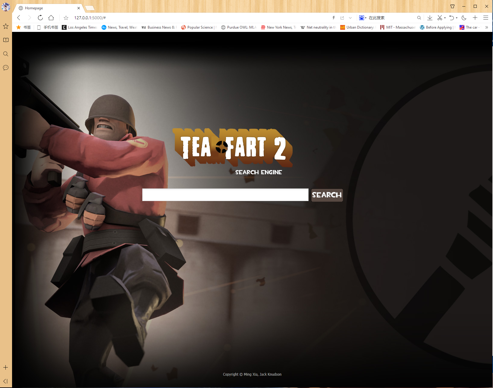
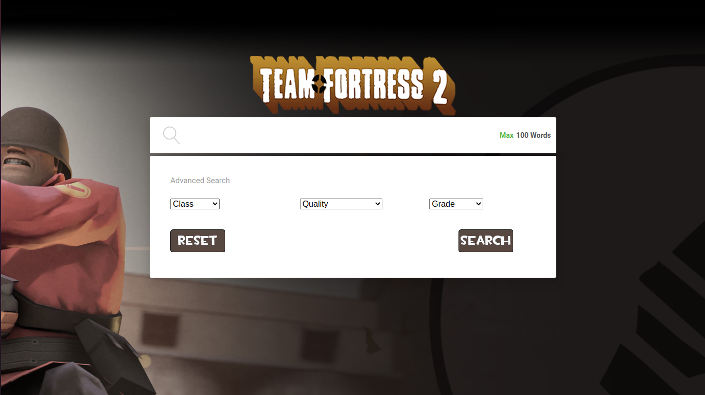

# Fortress 2 Item Search Engine

A web-based search application for discovering and searching custom-named items from Team Fortress 2. Built with Flask and SQLite FTS5 for fast, relevant search results.

## Team Members

- Ming Xia
- Jack Knudson

## Screenshots

### Homepage
The main search interface featuring the Team Fortress 2 theme with a clean, intuitive search bar.



### Advanced Search
Filter your searches by character class, item quality, and grade for more precise results.



### Autocomplete
Real-time search suggestions appear as you type, helping you find items quickly.


### Search Results
Paginated results display item thumbnails, custom names, quality, class information, and direct links to Steam profiles.


### Result Details
Each result shows comprehensive item information including custom name, quality, class, and owner Steam ID.


## Features

### User Interface
- **Autocomplete**: Real-time search recommendations as you type item names
- **Advanced Search Filters**: Refine searches by:
  - Character Class (Scout, Soldier, Pyro, Demoman, Heavy, Engineer, Sniper, Medic, Spy)
  - Quality (Unique, Decorated Weapon, Strange, Vintage, Genuine, Unusual, Haunted, Collector's, Self-Made)
  - Grade (Mercenary, Commando, Civilian, Assassin, Freelance, Elite)
- **Item Thumbnails**: Steam thumbnail images displayed with each search result
- **Pagination**: Results split into pages with 10 items per page
- **External Links**: Direct links to Steam profiles and Team Fortress 2 Wiki pages
- **No Results Page**: User-friendly error page when no items match the search

### Search Functionality
- **Multiple Ranking Algorithms**:
  - BM25 (default) - Best Match 25 relevance ranking
  - WikiID sorting
  - Frequency-based sorting
- **Full-Text Search**: Powered by SQLite FTS5 with Porter stemmer tokenization
- **Query Highlighting**: Matching search terms are highlighted in results
- **Word Filtering**: Filters out common but irrelevant words from search queries
- **Fast Performance**: Sub-second query response times

## Technologies

### Backend
- **Flask**: Python web framework for HTTP request handling and routing
- **SQLite3 with FTS5**: Full-text search using:
  - BM25 ranking algorithm
  - Porter stemmer tokenization
  - ASCII folding for case-insensitive search
- **Pandas**: Data processing and CSV import
- **flask_paginate**: Pagination support for search results

### Frontend
- **HTML/CSS**: Custom styling with Team Fortress 2 theme
- **jQuery & jQuery UI**: Autocomplete functionality
- **Choices.js**: Enhanced dropdown select components
- **Foundation CSS**: Responsive pagination styling

### Deployment
- **Gunicorn**: WSGI HTTP Server for production deployment

## Dataset Description

The dataset contains custom-named items from Team Fortress 2. Each record includes:

| Field | Description |
|-------|-------------|
| **Name** | The default/original name of the item |
| **Custom Name** | Player-assigned custom name for the item |
| **Class** | Which character class can use the item (Scout, Soldier, etc.) |
| **Quality** | Item quality tier (Strange, Unusual, Vintage, etc.) |
| **Description** | Player-custom descriptions or achievements |
| **Owner Information** | Steam profile ID and link to the owner |
| **Thumbnail** | Visual representation of the item from Steam |
| **Wiki ID** | Reference ID linking to Team Fortress 2 Wiki |

## Installation

### Prerequisites
- Python 3.7 or higher
- pip package manager

### Setup

1. Clone the repository:
```bash
git clone https://github.com/yourusername/Fortress2Search-Engine.git
cd Fortress2Search-Engine
```

2. Install dependencies:
```bash
pip install -r requirements.txt
```

### Dependencies
```
flask
regex
flask_paginate
db-sqlite3
pandas
gunicorn
```

## Usage

### Development Mode
```bash
python app.py
```
The application will start at `http://localhost:5000`

### Production Mode
```bash
gunicorn app:app
```

### How to Search

1. **Basic Search**: Enter item name or keywords in the search bar and click "Search"
2. **Advanced Search**: Click "Advanced Search" to reveal filter options:
   - Select a character class to filter by class
   - Select a quality tier to filter by item quality
   - Select a grade to filter by item grade
3. **Sort Results**: Use the sidebar options to sort by BM25 relevance, WikiID, or Frequency
4. **Navigate Results**: Use pagination at the bottom to browse through results
5. **View Item Details**: Click on item names to view more information or visit Steam profiles

## Project Structure

```
Fortress2Search-Engine/
|
|-- app.py                      # Main Flask application entry point
|-- requirements.txt            # Python dependencies
|-- .gitignore                  # Git ignore rules
|-- README.md                   # Project documentation
|
|-- src/                        # Source code modules
|   |-- __init__.py             # Package initialization
|   |-- database.py             # SQLite database setup and FTS5 initialization
|   |-- search_engine.py        # Search query logic (BM25, WikiID, frequency)
|   |-- autocomplete.py         # Autocomplete data retrieval
|
|-- data/                       # Data files
|   |-- mainitem.db             # SQLite database file
|   |-- formattedDataset.csv    # Source data (imported into database)
|
|-- docs/                       # Documentation
|   |-- screenshots/            # Application screenshots
|       |-- homepage.png
|       |-- advanced_search.png
|       |-- autocomplete.png
|       |-- search_results.png
|       |-- result_details.png
|
|-- templates/                  # HTML templates (Jinja2)
|   |-- index.html              # Homepage with search form
|   |-- result.html             # Search results display
|   |-- groups.html             # Grouped results view
|   |-- 404.html                # No results error page
|
|-- static/                     # Static assets
    |-- css/                    # CSS stylesheets
    |   |-- main.css            # Homepage styles
    |   |-- result.css          # Results page styles
    |   |-- style.css           # Common styles
    |   |-- 404.css             # Error page styles
    |   |-- foundation.css      # Foundation framework
    |
    |-- img/                    # Images and icons
    |   |-- bg.jpg              # Background image
    |   |-- logo1.png           # Logo
    |   |-- (other UI assets)
    |
    |-- js/                     # JavaScript files
        |-- choices.js          # Dropdown enhancement library
```

## API Routes

| Route | Method | Description |
|-------|--------|-------------|
| `/` | GET, POST | Homepage with search form and autocomplete |
| `/dataPage/<query>` | GET | Process search and display paginated results |
| `/results` | GET | Alternative search endpoint with sort parameters |
| `/groupPage` | GET | Display grouped item results |

## License

This project was developed for CIS 5210 coursework.
